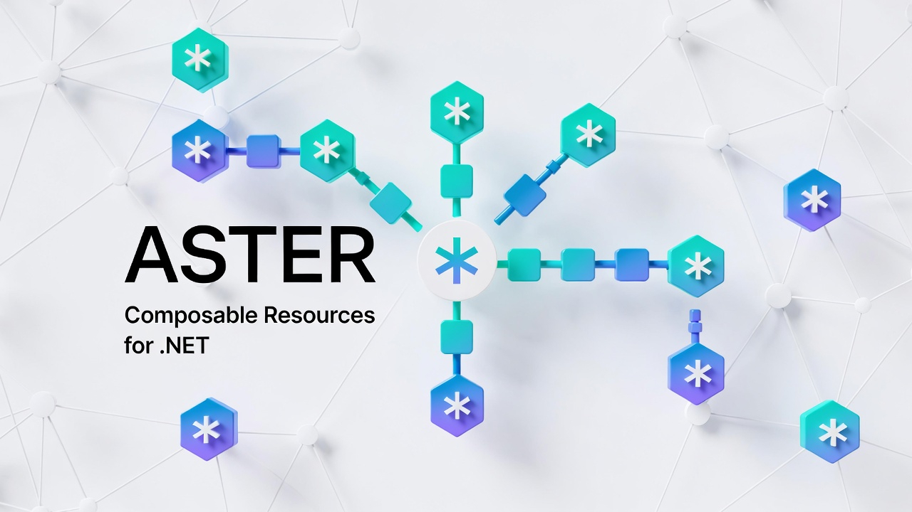

# Aster



**Aster** is a .NET SDK for defining, versioning, and querying composable resources using a **Resource → Aspect → Facet** model.

It provides a headless, backend-agnostic foundation for attaching reusable, cross-cutting capabilities (Tags, Owner, RBAC, Scheduling, …) to any resource type — without hard-coding every entity from scratch.

> **Status:** Phase 1 (Core SDK & In-Memory Engine) — active development. See [Roadmap](#roadmap) for future phases.

---

## Table of Contents

- [Concepts](#concepts)
- [Quick Start](#quick-start)
- [DI Registration](#di-registration)
- [Querying](#querying)
- [Versioning & Activation](#versioning--activation)
- [Typed Aspects & Facets](#typed-aspects--facets)
- [Project Structure](#project-structure)
- [Roadmap](#roadmap)
- [Contributing](#contributing)
- [License](#license)

---

## Concepts

| Term | Description |
|---|---|
| **Resource Definition** | The schema for a resource type (e.g. `Product`, `WorkflowDefinition`). Immutable — each update appends a new definition version. |
| **Resource** | A versioned instance of a Resource Definition. `ResourceId` is stable across versions; `Id` identifies the exact version snapshot. |
| **Aspect Definition** | A reusable "part" that can be attached to any Resource Definition (e.g. `TitleAspect`, `PriceAspect`). |
| **Aspect Instance** | The per-resource-version data for an attached aspect, stored as a dictionary of facet values. |
| **Facet Definition** | A typed field declared inside an Aspect Definition (e.g. `Title: string`, `Amount: decimal`). |
| **Facet Value** | The actual value of a facet on an aspect instance. |
| **Activation Channel** | A named delivery context (e.g. `"Published"`, `"Staging"`). A resource version becomes _active_ when placed in a channel. Multiple channels and multiple simultaneously active versions are supported. |

Resources follow an **append-only versioning model** — versions are never mutated. A version with no activation entry is implicitly a draft.

---

## Quick Start

### 1. Register services (ASP.NET Core / Generic Host)

```csharp
builder.Services.AddAsterCore();
```

This registers the in-memory store, resource manager, query service, typed aspect/facet binders, and identity generator.

### 2. Define a Resource Type

```csharp
using Aster.Core.Definitions;

// Plain C# records become typed aspects
private record TitleAspect(string Title);
private record PriceAspect(decimal Amount, string Currency);

var definition = new ResourceDefinitionBuilder()
    .WithDefinitionId("Product")
    .WithAspect<TitleAspect>()
    .WithAspect<PriceAspect>()
    .Build();

await definitionStore.RegisterDefinitionAsync(definition);
```

### 3. Create a Resource

```csharp
var resource = await manager.CreateAsync("Product", new CreateResourceRequest
{
    InitialAspects = new Dictionary<string, object>
    {
        ["TitleAspect"] = new TitleAspect("Super Gadget"),
        ["PriceAspect"] = new PriceAspect(99.99m, "USD"),
    }
});
// resource.Version == 1, no activation entry → implicitly draft
```

### 4. Update (Save a New Version)

```csharp
var v2 = await manager.UpdateAsync(resource.ResourceId, new UpdateResourceRequest
{
    BaseVersion = resource.Version,   // optimistic lock
    AspectUpdates = new Dictionary<string, object>
    {
        ["TitleAspect"] = new TitleAspect("Super Gadget Pro"),
    }
});
// v2.Version == 2
```

### 5. Activate in a Channel

```csharp
await manager.ActivateAsync(resource.ResourceId, version: 2, channel: "Published");
```

### 6. Read Back with Typed Aspects

```csharp
var latest = await manager.GetLatestVersionAsync(resource.ResourceId);

var title = latest!.GetAspect<TitleAspect>("TitleAspect", binder);
Console.WriteLine(title?.Title); // "Super Gadget Pro"
```

---

## DI Registration

`AddAsterCore()` wires the following services:

| Interface | Default Implementation |
|---|---|
| `IResourceDefinitionStore` | `InMemoryResourceDefinitionStore` |
| `IResourceManager` | `InMemoryResourceManager` |
| `IResourceWriteStore` | `InMemoryResourceManager` |
| `IResourceQueryService` | `InMemoryQueryService` |
| `ITypedAspectBinder` | `SystemTextJsonAspectBinder` |
| `ITypedFacetBinder` | `SystemTextJsonFacetBinder` |
| `IIdentityGenerator` | `GuidIdentityGenerator` |

All services are registered as **singletons** — the in-memory store is the single shared instance within the process.

---

## Querying

Use `IResourceQueryService` with a portable `ResourceQuery` AST:

```csharp
var results = await queryService.QueryAsync(new ResourceQuery
{
    DefinitionId = "Product",
    Filter = new AspectFacetFilter
    {
        AspectKey  = "TitleAspect",
        FacetName  = "Title",
        Operator   = ComparisonOperator.Contains,
        Value      = "Gadget",
    },
    Skip = 0,
    Take = 20,
});
```

The in-memory evaluator supports `Equals` and `Contains` operators. `Range` is planned for Phase 2+.

---

## Versioning & Activation

- **Immutable versions** — every call to `UpdateAsync` appends a new version.
- **Optimistic concurrency** — `UpdateResourceRequest.BaseVersion` must match the current latest; mismatches throw `ConcurrencyException`.
- **Activation** — `ActivateAsync(resourceId, version, channel, allowMultipleActive)`:
  - `allowMultipleActive = false` (default): deactivates all other versions in the channel first.
  - `allowMultipleActive = true`: adds alongside existing active versions.
- **Retrieval helpers** on `IResourceManager`:
  - `GetLatestVersionAsync` — the most recently created version.
  - `GetVersionAsync(resourceId, version)` — a specific version snapshot.
  - `GetVersionsAsync(resourceId)` — all versions.
  - `GetActiveVersionsAsync(resourceId, channel)` — all active versions in a channel.

### Exception reference

| Exception | When thrown |
|---|---|
| `ConcurrencyException` | `BaseVersion` mismatch on update or activate |
| `VersionNotFoundException` | Requested version does not exist |
| `SingletonViolationException` | Creating a second instance of a singleton definition |
| `DuplicateResourceIdException` | Caller-supplied `ResourceId` already exists |
| `DuplicateAspectAttachmentException` | Same aspect key attached twice to a definition |

---

## Typed Aspects & Facets

Any C# class or record can be used as a typed aspect:

```csharp
record PriceAspect(decimal Amount, string Currency);
```

**Read** a typed aspect from a resource:

```csharp
var price = resource.GetAspect<PriceAspect>("PriceAspect", binder);
```

**Write** a typed aspect (returns a new immutable `Resource` record — State Replace semantics):

```csharp
var updated = resource.SetAspect("PriceAspect", new PriceAspect(129.99m, "USD"), binder);
```

The same pattern works at the **facet level** via `AspectInstance.GetFacet<T>` and `AspectInstance.SetFacet<T>`.

The default `ITypedAspectBinder` implementation uses `System.Text.Json`.

---

## Project Structure

```
src/
  core/
    Aster.Core/              ← Main SDK library (net8.0 / net9.0 / net10.0)
      Abstractions/          ← Interfaces (IResourceManager, IResourceDefinitionStore, …)
      Definitions/           ← ResourceDefinitionBuilder (fluent API)
      Exceptions/            ← Typed exceptions
      Extensions/            ← DI helpers, GetAspect / SetAspect extensions
      InMemory/              ← In-memory implementations
      Models/                ← Domain models (Resource, AspectDefinition, ResourceQuery, …)
      Services/              ← SystemTextJson binders, GuidIdentityGenerator
  apps/
    Aster.Web/               ← Workbench / playground (ASP.NET Core minimal API)
test/
  Aster.Tests/               ← xUnit tests (unit + integration)
docs/                        ← Architecture review, coding conventions, roadmap
specs/                       ← Feature specs (001-core-sdk-foundation, …)
```

---

## Roadmap

| Phase | Title | Status |
|---|---|---|
| **1** | Core SDK & In-Memory Engine | 🚧 In Progress |
| **2** | Persistence & Querying (reference backend) | 📋 Planned |
| **3** | Advanced Indexing & Typed Querying | 📋 Planned |
| **4** | Portability & Integration Hooks | 📋 Planned |
| **5** | Multi-tenancy, Policies, Advanced Versioning | 📋 Planned |
| **6** | Operational Hardening (concurrency, perf, migrations) | 📋 Planned |

See [`docs/roadmap.md`](docs/roadmap.md) for the full phase breakdown with epics and definitions of done.

### Planned package layout (future)

```
Aster.Abstractions
Aster.Definitions
Aster.Runtime
Aster.Querying
Aster.Indexing
Aster.Persistence.<Backend>   (e.g., SqliteJson, PostgresJsonb, Mongo)
Aster.Hosting
Aster.Recipes                 (optional)
```

---

## Contributing

Please read [`docs/coding-conventions.md`](docs/coding-conventions.md) before submitting a PR.

---

## License

MIT — see [`LICENSE`](LICENSE).
